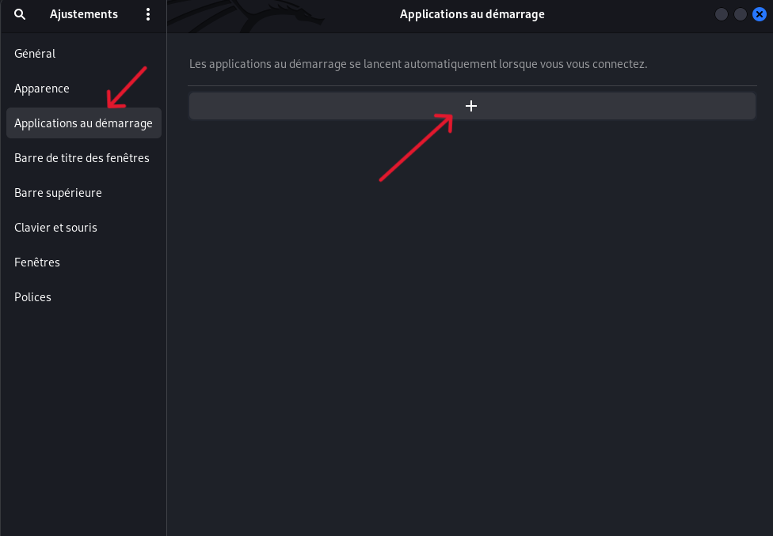
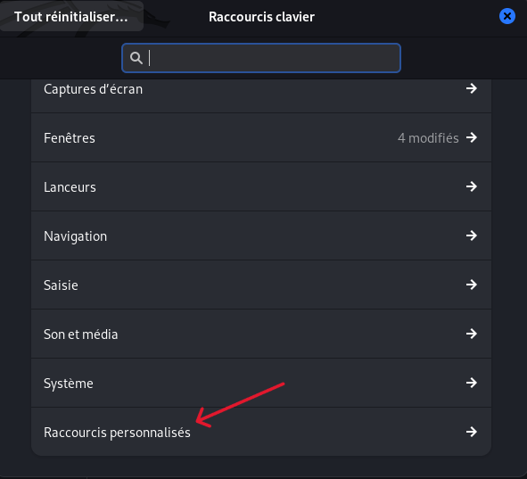
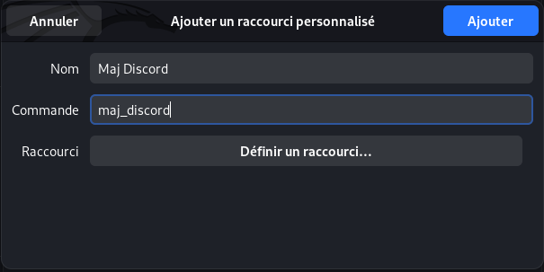

# MajDiscord
Permet de mettre à jour Discord de manière semi-automatique. Il suffit de télécharger la nouvelle version, il s'occupe du reste.

## Prérequis
<pre><code>apt install inotify-tools -y</code></pre>

Modifier au besoin le fichier `/etc/sudoers` et ajouter :
<pre><code>username ALL=(ALL) NOPASSWD: /usr/bin/dpkg -i /path/app</code></pre>

*Note : C'est pour avoir les notifications, pour ne pas avoir à ajouter un utilisateur en sudoer, il suffi de changer* `sudo dpkg -i "$directory"/"$new_file" > /dev/null 2>&1` *par* `dpkg -i "$directory"/"$new_file" > /dev/null 2>&1` *mais les notifications n'apparaîtrons pas.*

## Installation
<pre><code>git clone https://github.com/IAidenI/MajDiscord;chmod +x MajDiscord/maj_discord</code></pre>

**Penser à changer dans le chemin d'accès à du téléchargement des fichiers**

pour le lancer en arrière plan
<pre><code>nohup /chemin/vers/maj_discord &</code></pre>

Pour qu'il se lance au démmarage sous gnome :
Il faut ajouter le script à la variable d'environement PATH, pour cela éditer le fichier .bashrc (pour les environement bash, .zshrc pour zsh par exemple, pour savoir echo $SHELL) :
<pre><code>echo 'export PATH=/chemin/vers/le/dossier/de/maj_discord:$PATH' >> ~/.bashrc;source ~/.bashrc</code></pre>

Crée un fichier contenant cela et en modifiant les chmin d'accès (logo disponible dans src :
<pre><code>cat > ~/.local/share/applications/maj_discord.desktop
#!/bin/python3
[Desktop Entry]
Version=1.0
Type=Application
Name=MajDiscord
Exec=/chemin/vers/maj_discord
Icon=/chemin/vers/discord.png
Terminal=false
Categories=Utility</code></pre>

  

  

  

## Désactiver le script
<pre><code>ps -aux | grep "maj_discord"
kill PID_maj_discord</code></pre>
